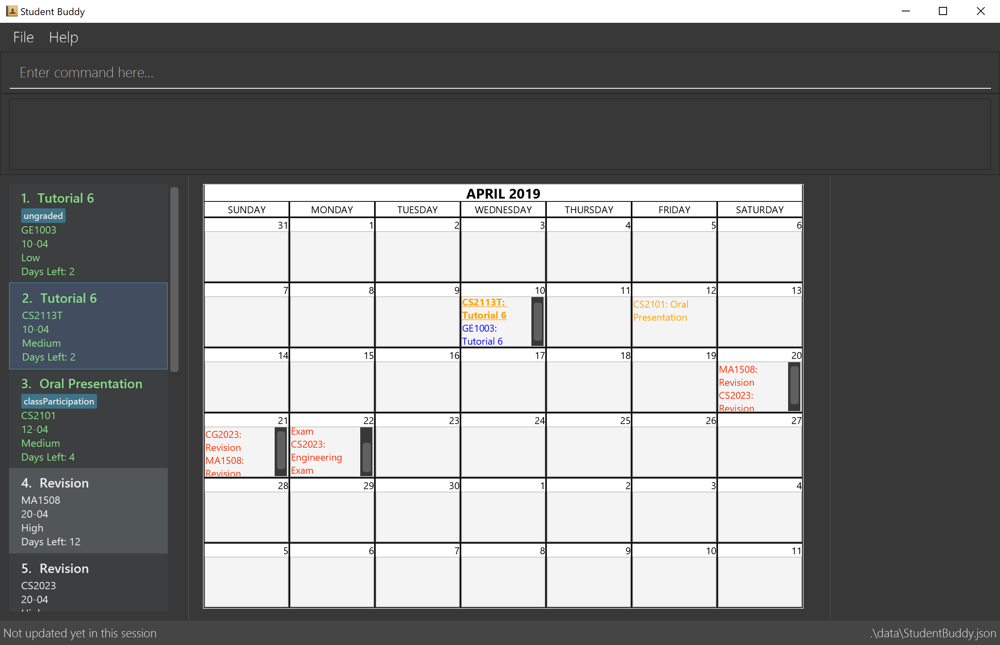

= Task Manager
ifdef::env-github,env-browser[:relfileprefix: docs/]

https://travis-ci.org/CS2113-AY1819S2-M11-2/main[image:https://travis-ci.org/CS2113-AY1819S2-M11-2/main.svg?branch=master[Build Status]]
https://coveralls.io/github/CS2113-AY1819S2-M11-2/main?branch=master[image:https://coveralls.io/repos/github/CS2113-AY1819S2-M11-2/main/badge.svg?branch=master[Coverage Status]]

ifdef::env-github[]

endif::[]

ifndef::env-github[]
image::images/Ui.png[width="600"]
endif::[]

== Welcome to Task Manager.
* A sophisticated event planner for the tech-savvy NUS student.
* A Command Line Interface (CLI) for quick input, and a pretty GUI for easy-to-read output.
* Inbuilt calendar and event viewer.
* Fast and responsive.

== Site Map

* <<UserGuide#, User Guide>>
* <<DeveloperGuide#, Developer Guide>>
* <<LearningOutcomes#, Learning Outcomes>>
* <<AboutUs#, About Us>>
* <<ContactUs#, Contact Us>>

== Acknowledgements

* This application was morphed from the AddressBook-Level4 project by the https://github.com/se-edu/[SE-EDU Initiative].
* Some parts of this sample application were inspired by the excellent http://code.makery.ch/library/javafx-8-tutorial/[Java FX tutorial] by
_Marco Jakob_.
* Libraries used: https://github.com/TestFX/TestFX[TextFX], https://github.com/FasterXML/jackson[Jackson], https://github.com/google/guava[Guava], https://github.com/junit-team/junit5[JUnit5]

== Licence : link:LICENSE[MIT]
